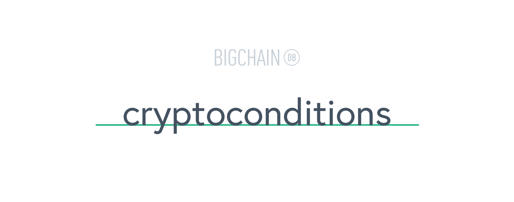

..

    Python implementation of Crypto-Conditions. Multi-algorithm, multi-level, multi-signature format for expressing conditions and fulfillments according to the Interledger Protocol (ILP)

.. image:: https://img.shields.io/pypi/v/cryptoconditions.svg
        :target: https://pypi.python.org/pypi/cryptoconditions

.. image:: https://img.shields.io/travis/bigchaindb/cryptoconditions/master.svg
        :target: https://travis-ci.org/bigchaindb/cryptoconditions

.. image:: https://img.shields.io/codecov/c/github/bigchaindb/cryptoconditions/master.svg
    :target: https://codecov.io/github/bigchaindb/cryptoconditions?branch=master

.. image:: https://readthedocs.org/projects/cryptoconditions/badge/?version=latest
    :target: http://cryptoconditions.readthedocs.io/en/latest/?badge=latest
    :alt: Documentation Status

Crypto Conditions
=================

* See draft of specification at `draft-thomas-crypto-conditions-02 <https://tools.ietf.org/html/draft-thomas-crypto-conditions-02>`_.
* The RFC is also on github under `rfcs/crypto-conditions <https://github.com/rfcs/crypto-conditions>`_.
* The Crypto-Conditions specification is part of the `Interledger Protocol (ILP) <https://interledger.org/rfcs/0003-interledger-protocol/>`_.

Motivation
----------

We would like a way to describe a signed message such that multiple actors in a
distributed system can all verify the same signed message and agree on whether
it matches the description.

This provides a useful primitive for distributed, event-based systems since we
can describe events (represented by signed messages) and therefore define
generic authenticated event handlers.

Installation
------------
To install latest release that is on PyPI:

.. code-block:: bash

    $ pip install cryptoconditions

Or install from source:

.. code-block:: bash

    $ pip install git+https://github.com/bigchaindb/cryptoconditions.git

Simple Usage
------------
*Yet to be documented.*

Documentation
-------------
http://cryptoconditions.readthedocs.io/
